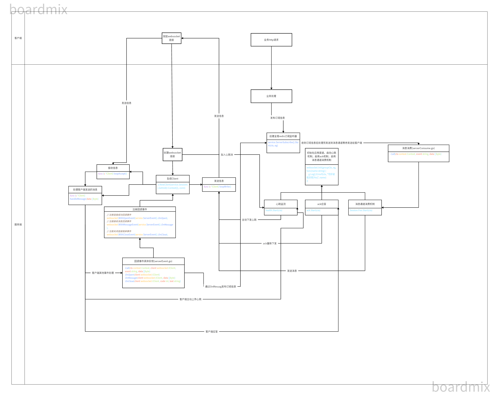

# im-server

### 介绍
基于goframe的im server端

### 说明

#### cache
&emsp;&emsp;&emsp;&emsp;&emsp;&emsp;&emsp;client.go里的client结构体的缓存服务接口定义及实现，用于将用户信息和用户客户端管理（绑定或解绑功能）

#### timeWheel
&emsp;&emsp;&emsp;&emsp;&emsp;&emsp;&emsp;基于gtimer实现的时间轮，用于定时执行任务，比如ack应答事件，客户端心跳维护

#### websocket
- ack.go 消息确认机制，当客户端及时响应后把任务从时间轮删除，反之则重复下发
- channel.go 通道管理器，用于管理客户端连接和消息传递，一般为业务逻辑处理完，需要下发的消息通过```Write```方法添加消息通道，等待处理
- client.go 实现 WebSocket 客户端的核心逻辑，包括消息的接收和发送
- event.go 用于处理 WebSocket 连接的各种事件，如连接建立成功、接收消息、连接关闭和销毁连接，用在client.go 的```NewClient```方法里，为客户端绑定自定义回调事件
- heartbeat.go 实现客户端心跳管理模块，用于定期检测客户端的心跳，确保客户端的连接处于活跃状态，和ack.go类似
- idGenerator.go 生成雪花键
- response.go 统一标准发送到消息通道的消息结构体及设置方法
- session.go 用于管理 WebSocket 连接的会话 负责初始化会话对象、渠道和一些守护协程
- websocket.go 定义websocket客户端的操作处理，使用 Gorilla WebSocket 包作为底层实现

#### serverSubscribe
&emsp;&emsp;&emsp;&emsp;&emsp;&emsp;&emsp;websocket服务一部分，主要负责处理连接建立、消息订阅以及消息的处理和分发。

#### serverEvent
&emsp;&emsp;&emsp;&emsp;&emsp;&emsp;&emsp;自定义回调事件具体实现，里面的方法实际上为event.go所使用的方法，同时也可以在里面添加对客户端发送过来的信息匹配对应处理事件，比如代码中的```onFoo```示例

#### serverConsume
&emsp;&emsp;&emsp;&emsp;&emsp;&emsp;&emsp;获得redis订阅消息后的具体方法处理逻辑，通过内容的event字段判断具体调用对应的方法，并将处理好的消息结构发送到channel通道中等待发送

### 流程

